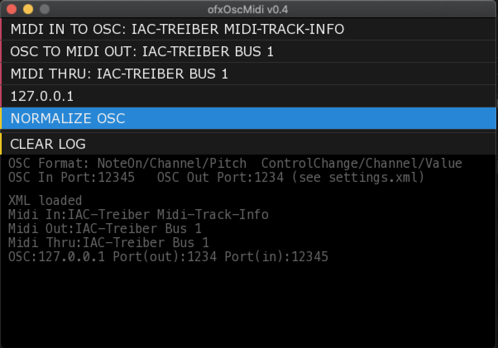

# ofxOscMidi
Midi/OSC helper based on openFrameworks.  
  
  
Important: Windows binaries ("exe-files") are not updated any more. If you want the latest version on Windows you have to compile it yourself.  
  
Midi In -> OSC Out.  
OSC In -> Midi Out.  
Midi In -> Midi Thru.  
  
You can decide if OSC messages (in and out) are treated as normalized or as 7bit (0..127).  
Settings are stored in 'settings.xml' upon termination.  
  
OSC messages are formatted like this:  
  
&nbsp;&nbsp;&nbsp;noteOn/[Channel]/[Pitch].  
&nbsp;&nbsp;&nbsp;controlChange/[Channel]/[value].  
  
  
  
## Dependencies:  
ofxDatGui https://github.com/braitsch/ofxDatGui  
ofxMidi https://github.com/danomatika/ofxMidi  
ofxNetworkUtils https://github.com/bakercp/ofxNetworkUtils  
ofxPoco.  
ofxOsc.  
ofxXmlSettings.  

## Build instructions  
These instructions are tested on MacOS 'Big Sur' and above.  
They are basically copy-pasted from https://github.com/Andymann/ofxMidiClockAbletonLink with the important bits adjusted.  
They will download, install and prepare openframeworks v0.12.0 on your machine, download all dependencies and build ofxOscMidi.  
(Note: the repository still contains a bunch of dll files and an *.exe. These date back from the time when I also built on Windows. They might work, they might not. I cannot guarantee, I cannot support Windows any more. Delete all *.dll and *.exe if you are in Linux/ MacOS. )

curl -k -L -o ofx.zip https://github.com/openframeworks/openFrameworks/releases/download/0.12.0/of_v0.12.0_osx_release.zip  
unzip ofx.zip  
rm ofx.zip  
mv of_v* openFrameworks/  
cd openFrameworks/  
export OF_ROOT=$(pwd)  
cd addons/  
git clone https://github.com/braitsch/ofxDatGui  
gi clone https://github.com/danomatika/ofxMidi  
git clone https://github.com/bakercp/ofxNetworkUtils  
cd ../apps/myApps/  
git clone https://github.com/Andymann/ofxOscMidi.git  
cd ofxOscMidi/  
echo y | rm -r ./bin/ofxMidiClockAbletonLink.app  
make clean && make  
open ./bin  